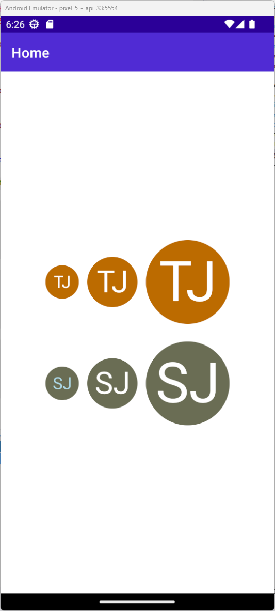
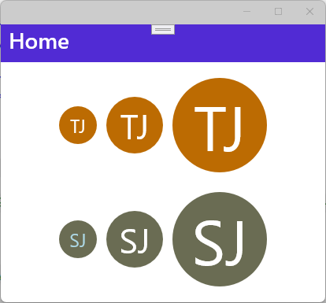
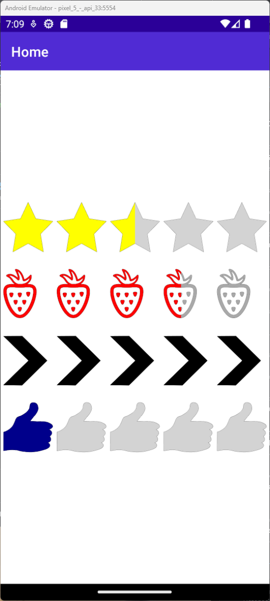
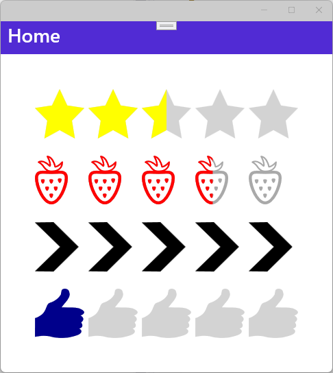

# Controls Library for .NET MAUI

This repository contains some custom made controls for your .NET MAUI application. This library is currently under development and for the moment there is only a `RatingControl` available.

## Installation

Install the package via [NuGet](https://www.nuget.org/packages/tsjdevapps.MauiControlsLib).

<a href="https://www.nuget.org/packages/tsjdevapps.MauiControlsLib" target="_blank"></a>

## Initialization

Open the class `MauiProgram` and call `UseMauiControlsLib()` on the `MauiAppBuilder`.

```csharp
MauiAppBuilder builder = MauiApp.CreateBuilder();
builder
    .UseMauiApp<App>()
    .UseMauiControlsLib() // <--
    .ConfigureFonts(fonts =>
    {
        fonts.AddFont("OpenSans-Regular.ttf", "OpenSansRegular");
        fonts.AddFont("OpenSans-Semibold.ttf", "OpenSansSemibold");
    });

return builder.Build();
```

In order to make use of the control within XAML you can use this namespace:

```xml
xmlns:controls="http://www.tsjdev-apps.de/controls/maui"
```

## Available Controls

### InitialsControl

You can use the `InitialsControl` in your .NET MAUI application to show a round badge with the initials of a person.

The following table explains all the available properties and their default value.

| **name** | **type** | **default value** | **description** |
|-|-|-|-|
| `DefaultBackgroundColor` | `Color` | `Colors.LightGray` | Indicates the default background color if no `name` is available |
| `TextColorLight` | `Color` | `Colors.White` | Indicates the light text color |
| `TextColorDark` | `Color` | `Colors.Black` | Indicates the dark text color |
| `Name` | `string` | `string.Empty` | Indicates the name to take the initials from |
| `Size` | `ControlSize` | `ControlSize.Small` | Indicates the size of the control |

*Screenshot of `InitialsControl` on **Android***




*Screenshot of `InitialsControl` on **Windows***




### RatingControl

You can use the `RatingControl` in your .NET MAUI application.

The following table explains all the available properties and their default value.

| **name** | **type** | **default value** | **description** |
|-|-|-|-|
| `Amount` | `int` | `5` | Indicates the number of rating items to be displayed |
| `CurrentValue` | `float` | `2.5f` | Indicates the current rating value to be displayed |
| `ItemSize` | `float` | `24f` | Indicates the size of each rating item |
| `ItemSpacing` | `float` | `6f` | Indicates the spacing between each rating item. |
| `FillColor` | `Color` | `Colors.Yellow` | Indicates the fill color to be used for each rating item |
| `UnfillColor` | `Color` | `Colors.LightGray` | Indicates the unfill color to be used for each rating item |
| `Path` | `string` | `<Star>` | Indicates the path used to draw each rating item |

*Screenshot of `RatingControl` on **Android***




*Screenshot of `RatingControl` on **Windows***




## Buy Me A Coffee

I appreciate any form of support to keep my _Open Source_ activities going.

Whatever you decide, be it reading and sharing my blog posts, using my NuGet packages or buying me a coffee/book, thank you ❤️.

<a href="https://www.buymeacoffee.com/tsjdevapps" target="_blank"></a>


## Contributing

Pull requests are welcome. For major changes, please open an issue first to discuss what you would like to change.

## License

[MIT](https://choosealicense.com/licenses/mit/)
